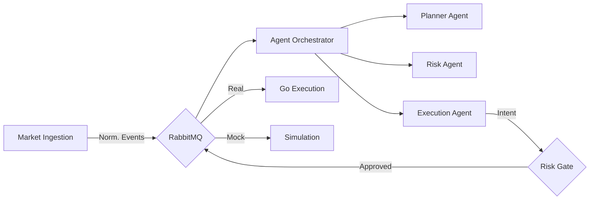
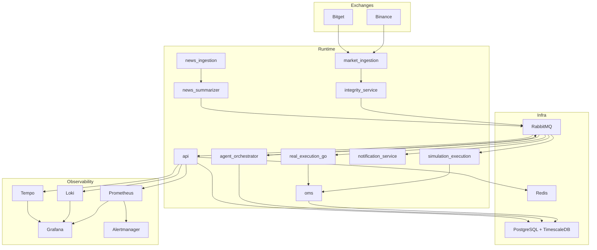

# Open Trader

<div align="center">


**AI-native crypto trading system.**
_Multi-Agent Decisioning • Deterministic Risk Engine • Real-Time Execution_

[Features](#key-features) • [Architecture](#architecture) • [Getting Started](#getting-started) • [Documentation](docs/)

</div>

---

## Overview

**Open Trader** is a production-ready, multi-exchange crypto trading platform powered by LLM agents. Unlike simple trading bots, it generates decisions using a **multi-agent orchestration layer** (Planner, Risk, Execution) that combines real-time market microstructure with news intelligence.

It features a **Hybrid Architecture**:

- **Python (3.13+)**: For high-level agentic strategy, orchestration, and data ingestion.
- **Go**: For ultra-low-latency order execution and signing.
- **Deterministic Risk**: Pre-trade risk guardrails involving position limits, improved drawdown protection, and circuit breakers.

## Project Vision

Open Trader is designed to be the reference architecture for **AI-native, policy-safe, event-driven trading systems**:

- LLM agents generate ideas, but deterministic policy engines own safety and execution permission.
- Every decision is auditable (prompt, response, risk checks, execution, notification).
- The platform is built for progressive hardening: simulation-first, then exchange-connected runtime with explicit gates.

## Current Runtime Status

As of **2026-03-30**, the repository is fully aligned with ARD/PRD requirements:

- **768 passing tests** (Python 761 + Go 7), zero failures.
- Core services boot with `docker compose up -d` (Postgres, RabbitMQ, API, 5 workers).
- Pilot profile adds Redis, notification worker, execution lifecycle.
- Full profile adds Go real execution + Prometheus/Grafana/Loki/Tempo.
- All security review findings resolved (timing-safe auth, RS256-only, network isolation, git history purge).

## Key Features

- **Agentic Strategy Engine**: Multi-agent runtime with Planner, Risk, and Execution agents using short/long-term memory.
- **Dual Trading Modes**: Seamlessly switch between `MOCK` (simulated fills) and `REAL` (exchange execution) modes.
- **Omni-Channel Ingestion**: Real-data ingestion for Binance + Bitget with REST polling default and websocket compatibility.
- **News Intelligence**: Real-time crypto news ingestion, summarization, and sentiment analysis injected into strategy context.
- **Institutional Risk**: Hard guards for daily loss, max drawdown, leverage, and per-symbol exposure.
- **Full Observability (Full Profile)**: Prometheus/Grafana dashboards, Loki logs, and Tempo traces via `--profile full`. Per-worker `/metrics` endpoints (ports 8081-8086).
- **Multi-Channel Notifications**: Telegram, Email (SMTP), and Webhook gateways with retry, dedup, and DLQ.
- **JWT Refresh Tokens**: Short-lived access tokens (15 min) with 7-day refresh token rotation and Redis-backed revocation.
- **Redis-Backed Rate Limiting**: Sliding window rate limiter with automatic fallback to in-memory for single-instance deployments.
- **RS256 Authentication**: RSA-signed JWT tokens. No HS256 fallback — algorithm confusion attacks prevented.

## Architecture

The system follows a strict event-driven architecture utilizing **RabbitMQ** for reliable messaging and **TimescaleDB** for high-frequency data.



### Expanded Architecture



## Service Breakdown

- `services/market_ingestion`: exchange adapters, normalization, integrity helpers.
- `services/integrity_service`: dedicated boundary for runtime integrity workflows.
- `services/agent_orchestrator`: planner/risk/execution decision orchestration, guardrails, replay.
- `services/llm_gateway`: provider abstraction, quota enforcement, prompt/response persistence.
- `services/simulation_execution`: mock execution engine + mode safety checks.
- `services/real_execution_go`: low-latency execution consumer/handler contracts in Go.
- `services/oms`: lifecycle state machine, fill reconciliation, position/portfolio logic, risk policy, drawdown/daily loss guards.
- `services/news_ingestion` + `services/news_summarizer`: ingest, dedupe, tag/relevance, summarization, context bridge.
- `services/notification_service`: policy routing, gateway dispatch (Telegram/Email/Webhook), worker loop.
- `services/api`: FastAPI control plane, RS256 auth + RBAC, ops/governance/replay/news/notification routes.
- `services/api/rate_limiter`: Redis-backed + in-memory sliding window rate limiting.
- `services/tasks`: Celery workloads — portfolio rollup, news backfill, data retention, notification digest, replay reports.

## End-to-End Event Flow

1. Market data arrives from Binance/Bitget.
2. Canonicalized events are published to RabbitMQ.
3. Orchestrator runs planner/risk/execution agents and guardrails.
4. Execution intent is routed to mock (`execution.intent.mock`) or real (`execution.intent.real`) queues.
5. Execution emits OMS lifecycle events and portfolio/risk updates.
6. Notification bridge emits severity-classified events; Telegram worker dispatches.
7. API and observability surfaces expose state, governance, replay, and operations telemetry.

## Getting Started

### Prerequisites

- **Docker & Docker Compose**
- **Python 3.13+** (managed via `uv`)
- **Go 1.23+** (only for real execution service development)

### Quick Start

1. **Clone and Bootstrap**

   ```bash
   git clone https://github.com/kaiqiangh/openTrader.git
   cd openTrader
   ```

2. **Configure Environment**

   ```bash
   cp .env.example .env
   # Required keys in .env:
   # - ENCRYPTION_KEY_BASE64 (AES-256-GCM for exchange credentials)
   # - JWT_PRIVATE_KEY + JWT_PUBLIC_KEY (RS256 auth — generate with scripts/generate_token_rs256.py)
   # Optional:
   # - TELEGRAM_BOT_TOKEN + TELEGRAM_DEFAULT_CHAT_ID (for Telegram notifications)
   # - EMAIL_SMTP_HOST + EMAIL_FROM_ADDRESS (for Email notifications)
   # - WEBHOOK_URL (for Webhook notifications)
   # - NOTIFY_ENABLED=false (if no notification gateway is configured)
   ```

3. **Validate Environment**

   ```bash
   make env-validate
   ```

4. **Launch Stack**

   ```bash
   docker compose up -d
   ```

5. **Open Frontend Dashboard (standalone Next.js app)**
   - Dashboard URL: `http://localhost:3000`
   - API URL: `http://localhost:8000`
   - Dashboard API calls require a JWT bearer token; paste a viewer/operator/admin token into the "Session Token" field shown in the UI.
   - Legacy API paths under `http://localhost:8000/dashboard` now show migration notices and link to the Next dashboard.

Use this sequence from the project root:

1. Verify Python and uv:

- `python3 --version` (expect `3.13.x` or compatible)
- `uv --version`

2. Sync dependencies into `.venv`:

- `uv sync --all-groups`

3. Validate env keys:

- `cp .env.example .env` (first time only)
- `make env-validate`

The runtime settings loaders now auto-read `.env` from the current working directory for:

- `services/api/settings.py`
- `services/notification_service/settings.py`
- `migrations/env.py`

4. Run tooling through uv:

- `uv run ruff check .`
- `uv run pytest -q`

5. Run Go tests for real execution service:

- `cd services/real_execution_go && GOCACHE=/tmp/go-build go test ./...`

## Service and Script Runbook

### Recommended startup sequence (fresh environment)

Use this order when you bring up the stack for the first time or after a reset:

```bash
# 1) Validate env and toolchain
make env-validate

# 2) Start core infra + services
docker compose up -d

# 3) Confirm migration completed and services are healthy
docker compose ps
curl -s http://127.0.0.1:8000/health/readiness

# 4) Run a lightweight smoke check
make smoke
```

If you also want observability and Go real execution components:

```bash
docker compose --profile full up -d
make smoke-full
```

### Start all services (lean core, pilot, full)

Run from repo root:

```bash
docker compose up -d
```

This starts the lean core runtime (recommended default):

- `postgres_timescaledb`
- `rabbitmq`
- `migrator` (one-shot; expected `Exited (0)` after success)
- `api`
- `web_dashboard`
- `runtime_worker_market`
- `runtime_worker_orchestrator`
- `runtime_worker_simulation`
- `runtime_worker_oms`
- `runtime_worker_news`

To include REAL-pilot support and optional ops workers:

```bash
docker compose --profile pilot up -d
```

Pilot profile adds:

- `redis`
- `notification_worker`
- `runtime_worker_execution_lifecycle`

To include Go real execution and observability stack, use full profile:

```bash
docker compose --profile full up -d
```

Full profile adds:

- `real_execution_go`
- `prometheus`
- `alertmanager`
- `loki`
- `tempo`
- `grafana`

### Check status and health

```bash
docker compose ps
curl -s http://127.0.0.1:8000/health/liveness
curl -s http://127.0.0.1:8000/health/readiness
```

Useful service URLs:

- Dashboard (Next.js): `http://127.0.0.1:3000`
- API: `http://127.0.0.1:8000`
- API legacy dashboard notice route: `http://127.0.0.1:8000/dashboard`
- RabbitMQ management: `http://127.0.0.1:15672`
- Grafana (full profile): `http://127.0.0.1:3001`

### Runtime log verification and pipeline diagnostics

Use these commands when dashboard data is empty or runtime workers look idle:

```bash
# Runtime worker structured logs (JSON lines)
docker compose logs --since=3m \
  runtime_worker_market runtime_worker_orchestrator runtime_worker_simulation \
  runtime_worker_oms runtime_worker_news

# Include lifecycle/notification logs only when pilot profile is enabled
docker compose logs --since=3m runtime_worker_execution_lifecycle notification_worker

# API health and pipeline diagnostics
curl -s http://127.0.0.1:8000/health/readiness
curl -s -H "Authorization: Bearer <JWT>" \
  "http://127.0.0.1:8000/ops/pipeline/health?mode=MOCK"
```

The pipeline endpoint reports stage-level status for:

- `market.klines`
- `market.orderbook`
- `news.items`
- `agent.decisions`
- `llm.calls`
- `trading.fills`
- `portfolio.snapshots`

### Reset all container data (volumes)

This removes all persisted local runtime data (Postgres, RabbitMQ, Redis, Grafana/Loki/Tempo/Prometheus volumes):

```bash
docker compose --profile full down -v --remove-orphans
docker volume prune -f
docker compose up -d
```

### Start services individually (local process mode)

Use this only if you intentionally run services outside Docker.

```bash
# Next dashboard app
cd apps/dashboard
npm install
npm run dev
cd ../..

# API
uv run python -m uvicorn services.api.app:create_app --factory --host 0.0.0.0 --port 8000

# Notification worker
uv run python -m services.notification_service.worker

# Runtime workers
uv run python -m services.workers.main --worker market --bootstrap-topology
uv run python -m services.workers.main --worker orchestrator --bootstrap-topology
uv run python -m services.workers.main --worker simulation
uv run python -m services.workers.main --worker oms
uv run python -m services.workers.main --worker news
uv run python -m services.workers.main --worker execution_lifecycle
```

Go real execution service (if needed locally):

```bash
cd services/real_execution_go
GOCACHE=/tmp/go-build go run .
```

### Script and gate commands

| Target / command                                                                     | What it does                                                                                   | Notes / output                                                                            |
| ------------------------------------------------------------------------------------ | ---------------------------------------------------------------------------------------------- | ----------------------------------------------------------------------------------------- |
| `make env-validate`                                                                  | Validates required env contract in `.env`.                                                     | Fails fast on missing/invalid keys.                                                       |
| `make migrate-up`                                                                    | Applies latest Alembic migrations.                                                             | Falls back to Docker-internal migration run if local DB path fails.                       |
| `make migrate-down`                                                                  | Rolls back one migration.                                                                      | Use only for local/dev rollback.                                                          |
| `make smoke`                                                                         | Core runtime smoke check.                                                                      | Starts core compose services and validates liveness/bridge basics.                        |
| `make smoke-full`                                                                    | Full-profile smoke check.                                                                      | Includes full profile validation (`real_execution_go`, observability).                    |
| `make runtime-gate`                                                                  | Runtime integration gate (core).                                                               | Writes `artifacts/runtime_integration_gate/latest.json`.                                  |
| `make runtime-gate-full`                                                             | Runtime integration gate (full profile).                                                       | Same report path, with full profile checks.                                               |
| `make mock-workflow`                                                                 | Strict real-data + mock-trade workflow probe.                                                  | Requires recent DB market/news data and reachable LiteLLM endpoint.                       |
| `uv run python scripts/llm_smoke_trigger.py --symbol BTC/USDT --mode MOCK`           | Forces one orchestrator cycle and validates `llm_calls` persistence for the injected decision. | Prints JSON summary with `decision_id`, `trace_id`, and latest persisted LLM call status. |
| `make live-probe`                                                                    | Nightly/live probe wrapper around mock workflow.                                               | Writes `artifacts/live_runtime_probe/latest.json`.                                        |
| `uv run python scripts/verify_orderbook_snapshots.py --symbol BTC/USDT`              | Validates orderbook snapshot persistence freshness.                                            | Useful for websocket/REST ingestion integrity checks.                                     |
| `uv run python scripts/verify_klines_persistence.py --symbol BTC/USDT --interval 1m` | Validates kline persistence freshness.                                                         | Checks kline ingestion continuity per exchange.                                           |

### Script usage patterns (when to run what)

- **Daily local startup**
  1. `make env-validate`
  2. `docker compose up -d`
  3. `make smoke`

- **Before opening a PR**
  1. `uv run ruff check .`
  2. `uv run pytest -q`
  3. `make runtime-gate`

- **Before enabling/validating REAL mode paths**
  1. `docker compose --profile full up -d`
  2. `make smoke-full`
  3. `make runtime-gate-full`
  4. (Optional) `make live-probe`

- **Data freshness debugging**
  1. `uv run python scripts/verify_orderbook_snapshots.py --symbol BTC/USDT`
  2. `uv run python scripts/verify_klines_persistence.py --symbol BTC/USDT --interval 1m`
  3. `make mock-workflow`

## UI Scope

- Current UI is a standalone Next.js React app (`apps/dashboard`) and read-only by default (`API_READ_ONLY_MODE=true`).
- Dashboard surfaces strategy status, orders/positions/portfolio, risk, news, replay, and LLM governance telemetry.
- DB writes are not performed from the UI layer; mutating operations remain backend-governed and auth-protected.

## Observability and Monitoring

- **Metrics**: Prometheus via `/metrics` on API (port 8000) and each worker (ports 8081-8086).
- **Worker metrics**: `open_trader_worker_starts_total`, `open_trader_worker_cycles_total` (by outcome), `open_trader_worker_cycle_duration_seconds`.
- **API metrics**: `open_trader_http_requests_total`, `open_trader_http_request_duration_seconds`.
- **Logs**: structured JSON fields (`trace_id`, `decision_id`, `strategy_id`, `mode`, `service`).
- **Traces**: W3C traceparent propagation across API/worker/Go runtime.
- **Dashboards/alerts**: Grafana + Alertmanager configs in `config/observability/`.
- SLO alert catalog includes ingestion p95 lag, websocket stream staleness, LLM latency/cost, execution latency, and risk block rate.

## Nightly Runtime Probe

- Script: `scripts/live_runtime_probe.py`
- Workflow: `.github/workflows/nightly-live-probe.yml`
- Artifact: `artifacts/live_runtime_probe/latest.json`

## Contribution Guide

1. Fork and create a branch (`features/<topic>`).
2. Run:
   - `uv run ruff check .`
   - `uv run pytest -q`
3. For Go service work:
   - `cd services/real_execution_go && GOCACHE=/tmp/go-build go test ./...`
4. Update docs (`README`, `docs/ARD_Consolidated.md`, `docs/IMPLEMENTATION_PLAN.md`) when architecture/runtime behavior changes.
5. Open PR with:
   - change summary,
   - risk assessment,
   - rollout/rollback notes.

## Roadmap

- **Phase 10 runtime production integration (completed)**: concrete worker entrypoints, RabbitMQ/DB adapter replacement, core/full compose profile split, strict real-data mock-workflow validation.
- **Security hardening (completed)**: timing-safe auth, RS256-only, network isolation, git history purge, drawdown/daily loss limits, Redis rate limiter.
- **Notification gateways (completed)**: Telegram, Email (SMTP), and Webhook gateways with retry/DLQ.
- **JWT refresh tokens (completed)**: short-lived access tokens with rotation and Redis-backed revocation.
- **Observability (completed)**: per-worker Prometheus /metrics endpoints, W3C trace propagation.
- **Next**: production deployment automation, Slack notification gateway, additional exchange adapters, advanced risk simulation.

## Future Vision

Open Trader aims to become a transparent autonomous trading platform where:

- AI reasoning is observable and auditable by default,
- policy and risk controls remain deterministic and enforceable,
- and operations teams can trust end-to-end behavior under real market stress.

## Key Module References

### Market Ingestion
- `services/market_ingestion/persistence_writers.py` — TimescaleDB kline/orderbook writers
- `services/market_ingestion/pipeline_metrics.py` — Prometheus ingestion metrics
- `services/market_ingestion/integration_harness.py` — Replay fixture test harness
- `services/market_ingestion/canonical_pipeline.py` — Exchange normalization pipeline
- `docs/market_ingestion_foundation.md` — Ingestion architecture doc

### Integrity Service
- `services/integrity_service/gap_detection.py` — Sequence gap detection
- `services/integrity_service/kline_validator.py` — K-line reconstruction validation

### Agent Runtime
- `services/agent_orchestrator/orchestrator.py` — Multi-agent decision orchestration
- `services/agent_orchestrator/planner_agent.py` — Dynamic plan generation
- `services/agent_orchestrator/risk_agent.py` — Pre-trade risk signals
- `services/llm_gateway/contracts.py` — Gateway provider contracts
- `services/llm_gateway/gateway.py` — Centralized model access layer
- `services/llm_gateway/persistence.py` — LLMCallRecord and prompt/response storage
- `services/llm_gateway/quota.py` — Token/cost quota enforcement (QuotaLimits, LLMQuotaStore)

### OMS + Risk
- `services/oms/fill_reconciliation.py` — Queue/exchange fill reconciliation
- `services/oms/position_engine.py` — Position tracking from fills
- `services/oms/portfolio_snapshot.py` — NAV/PnL snapshot engine
- `services/oms/risk_rules.py` — Position limits, leverage, drawdown, daily loss checks

### News Intelligence
- `services/news_ingestion/source_connectors.py` — Pluggable RSS/API connectors
- `services/news_ingestion/ingestion_service.py` — News pull/normalize/dedupe
- `services/news_ingestion/tagging_relevance.py` — Symbol/topic tagging

### API Control Plane
- `services/api/app.py` — FastAPI application factory
- `services/api/auth.py` — JWT auth + RBAC
- `services/api/routers/control.py` — Mode/strategy control endpoints

### Observability
- `services/shared/runtime/structured_logging.py` — JSON structured logger
- `services/shared/runtime/prometheus.py` — Prometheus metrics registry
- `services/shared/runtime/trace_context.py` — OpenTelemetry trace propagation

### Migrations
- `migrations/versions/20260214_0004_llm_governance_schema.py` — llm_calls, llm_usage tables
- `migrations/versions/20260219_0007_control_plane_notification_state.py` — strategy_runtime_state, mode_audit_events

### Validation
- `tests/test_p9_e2e_mock_flow.py` — E2E mock flow tests
- `tests/test_p9_e2e_real_flow.py` — E2E real flow tests
- `tests/test_p9_mode_isolation.py` — Mode separation verification

### Additional Module References
- `services/oms/risk_rules.py` — Position limits, leverage checks
- `services/oms/risk_guards.py` — Drawdown/daily loss guards
- `services/oms/risk_controls.py` — Circuit breaker/kill switch
- `services/oms/risk_policy.py` — Composed risk policy engine
- `services/oms/risk_observability.py` — Risk telemetry
- `services/agent_orchestrator/execution_decision_agent.py` — Final action proposal
- `services/agent_orchestrator/market_context_agent.py` — Market microstructure enrichment
- `services/agent_orchestrator/guardrail_validation.py` — Pre-publish intent validation
- `services/agent_orchestrator/memory_layer.py` — Redis/Postgres shared memory
- `services/agent_orchestrator/replay_service.py` — Deterministic decision replay
- `services/agent_orchestrator/metrics_tracing.py` — Agent latency/token metrics
- `services/market_ingestion/gap_detection.py` — Sequence gap detection for market data
- `services/market_ingestion/kline_validator.py` — Kline completeness validation
- `services/market_ingestion/canonical_pipeline.py` — Exchange normalization pipeline
- `docs/agent_runtime_baseline.md` — Agent runtime architecture doc

### Migration References
- `migrations/versions/20260214_0003_agent_trace_schema.py` — decision_traces, agent_runs, agent_messages tables
- `migrations/versions/20260214_0005_news_schema.py` — news_items, news_tags, news_summaries tables
- `migrations/versions/20260219_0007_control_plane_notification_state.py` — strategy_runtime_state, mode_audit_events tables
- `sa.ForeignKey("decision_traces.decision_id")` — Agent trace foreign key reference
- `uq_news_items_source_source_item_id` — News dedup unique constraint

### Additional References
- `services/news_ingestion/source_connectors.py` — Pluggable RSS/API source connectors
- `services/news_ingestion/tagging_relevance.py` — Symbol/topic tagging pipeline
- `docs/llm_gateway_baseline.md` — LLM gateway architecture doc
- `LLMCallRecord` — LLM call persistence record
- `QuotaLimits` — Token/cost quota configuration
- `LLMQuotaStore` — Quota enforcement store interface

### LLM Persistence & Quota
- `services/llm_gateway/persistence.py` — LLM call record persistence
- `services/llm_gateway/quota.py` — Token/cost quota enforcement
- `docs/learning/2026-02-14-p3-llm-persistence-instincts.md`
- `docs/learning/2026-02-14-p3-llm-quota-instincts.md`

### News Module Details
- `services/news_ingestion/quality_metrics.py` — News coverage/freshness metrics
- `services/news_summarizer/summarizer_service.py` — Rolling summary generation
- `services/news_summarizer/context_injection_bridge.py` — Summary → agent context
- `services/news_summarizer/resilience.py` — News module fallback behavior

### API Details
- `services/api/routers/ops.py` — Operations/governance endpoints
- `services/api/routers/governance.py` — LLM governance APIs
- `services/api/routers/replay.py` — Decision replay endpoints
- `services/api/routers/system.py` — Health, metadata, auth/token, auth/refresh endpoints
- `services/api/routers/dashboard.py` — Dashboard UI routes
- `services/api/auth.py` — JWT RS256 verification, token pair generation, refresh rotation
- `services/api/rate_limiter.py` — Redis-backed + in-memory rate limiters
- `apps/dashboard/src/components/dashboard-client.js` — Dashboard React client
- `apps/dashboard/app/globals.css` — Dashboard styles

### Observability Config
- `config/observability/prometheus.yml` — Prometheus scrape config
- `config/observability/alerts.yml` — Alert rule catalog
- `services/shared/runtime/key_encryption.py` — AES-256-GCM credential encryption
- `/metrics` — Prometheus metrics endpoint

### Validation Tests
- `tests/test_p9_e2e_mock_flow.py` — E2E mock flow validation
- `tests/test_p9_e2e_real_flow.py` — E2E real flow validation
- `tests/test_p9_mode_isolation.py` — Mode separation verification
- `tests/test_p9_replay_determinism.py` — Replay determinism tests
- `tests/test_p9_performance_benchmarks.py` — Performance benchmarks
- `tests/test_p9_chaos_resilience.py` — Chaos/resilience drills
- `docs/runtime/p9-validation-2026-02-14.md` — Validation evidence
- `docs/runtime/p9-replay-determinism-2026-02-15.md` — Replay evidence
- `docs/runtime/p9-performance-benchmark-2026-02-15.md` — Benchmark evidence
- `services/notification_service/models.py` — Notification data models
- `docs/runtime/p9-resilience-drills-2026-02-15.md` — Resilience drill evidence
- `services/notification_service/publishers.py` — Event publisher integrations
- `services/notification_service/telegram_gateway.py` — Telegram bot delivery
- `services/notification_service/email_gateway.py` — SMTP email delivery (HTML + plaintext)
- `services/notification_service/webhook_gateway.py` — HTTP POST webhook delivery (HMAC signing)
- `services/notification_service/observability.py` — Notification metrics/traces
- `services/notification_service/worker.py` — Notification worker loop
- `docs/runtime/p9-resilience-drills-2026-02-15.md` — Resilience drill evidence
- `tests/test_p9_data_integrity_audits.py` — Data integrity audit tests
- `tests/test_p9_security_acceptance.py` — Security acceptance tests
- `docs/runtime/p9-data-integrity-audit-2026-02-15.md` — Data integrity evidence
- `docs/runtime/p9-security-acceptance-2026-02-15.md` — Security acceptance evidence
- `docs/release/p9-release-checklist-2026-02-15.md` — Release checklist
- `docs/release/p9-cutover-and-rollback-2026-02-15.md` — Cutover/rollback plan
- `docs/release/p9-post-phase-handoff-pack-2026-02-15.md` — Post-phase handoff pack

### Runbooks
- `docs/runbooks/exchange-outage.md` — Exchange outage incident response
- `docs/runbooks/llm-quota-breach.md` — LLM quota breach response
- `docs/runbooks/risk-incident.md` — Risk incident response
