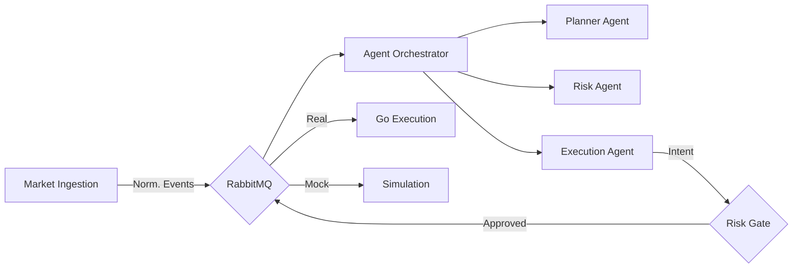
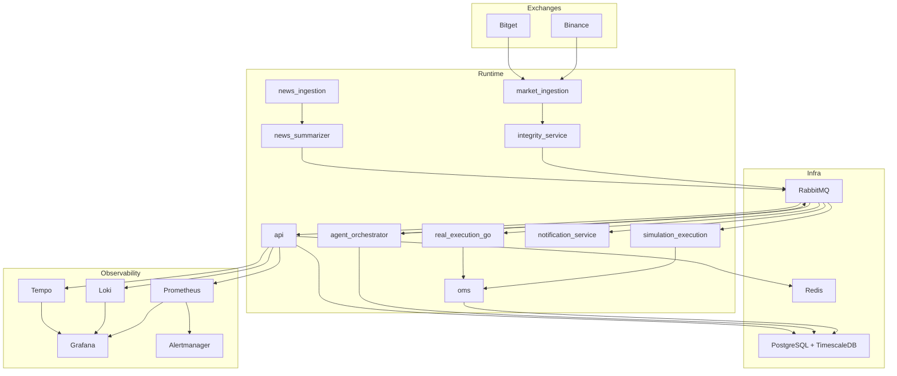

# Open Trader

<div align="center">


**AI-native crypto trading system.**
_Multi-Agent Decisioning • Deterministic Risk Engine • Real-Time Execution_

[Features](#key-features) • [Architecture](#architecture) • [Getting Started](#getting-started) • [Documentation](docs/)

</div>

---

## Overview

**Open Trader** is a production-ready, multi-exchange crypto trading platform powered by LLM agents. Unlike simple trading bots, it generates decisions using a **multi-agent orchestration layer** (Planner, Risk, Execution) that combines real-time market microstructure with news intelligence.

It features a **Hybrid Architecture**:

- **Python (3.13+)**: For high-level agentic strategy, orchestration, and data ingestion.
- **Go**: For ultra-low-latency order execution and signing.
- **Deterministic Risk**: Pre-trade risk guardrails involving position limits, improved drawdown protection, and circuit breakers.

## Project Vision

Open Trader is designed to be the reference architecture for **AI-native, policy-safe, event-driven trading systems**:

- LLM agents generate ideas, but deterministic policy engines own safety and execution permission.
- Every decision is auditable (prompt, response, risk checks, execution, notification).
- The platform is built for progressive hardening: simulation-first, then exchange-connected runtime with explicit gates.

## Current Runtime Status

As of **2026-02-16**, the repository is runtime-aligned for a strict **real-data + mock-trade** core workflow:

- core services boot with `docker compose up -d`,
- observability + Go real-execution extras boot with `docker compose --profile full up -d`,
- market/news ingestion, orchestration traces, LLM calls, and mock execution persistence are wired to Postgres.

## Key Features

- **Agentic Strategy Engine**: Multi-agent runtime with Planner, Risk, and Execution agents using short/long-term memory.
- **Dual Trading Modes**: Seamlessly switch between `MOCK` (simulated fills) and `REAL` (exchange execution) modes.
- **Omni-Channel Ingestion**: Real-data ingestion for Binance + Bitget with REST polling default and websocket compatibility.
- **News Intelligence**: Real-time crypto news ingestion, summarization, and sentiment analysis injected into strategy context.
- **Institutional Risk**: Hard guards for daily loss, max drawdown, and per-symbol exposure.
- **Full Observability (Full Profile)**: Prometheus/Grafana dashboards, Loki logs, and Tempo traces via `--profile full`.
- **Operator Alerts**: Severity-based notifications via Telegram for signals, fills, and risk events.

## Architecture

The system follows a strict event-driven architecture utilizing **RabbitMQ** for reliable messaging and **TimescaleDB** for high-frequency data.



### Expanded Architecture



## Service Breakdown

- `services/market_ingestion`: exchange adapters, normalization, integrity helpers.
- `services/integrity_service`: dedicated boundary for runtime integrity workflows (in progress toward concrete worker service).
- `services/agent_orchestrator`: planner/risk/execution decision orchestration and guardrails.
- `services/llm_gateway`: provider abstraction, quota enforcement, prompt/response persistence.
- `services/simulation_execution`: mock execution engine + mode safety checks.
- `services/real_execution_go`: low-latency execution consumer/handler contracts in Go.
- `services/oms`: lifecycle state machine, fill reconciliation, position and portfolio logic, risk policy.
- `services/news_ingestion` + `services/news_summarizer`: ingest, dedupe, tag/relevance, summarization, context bridge.
- `services/notification_service`: policy routing, gateway dispatch, Telegram gateway, worker loop.
- `services/api`: FastAPI control plane, auth/RBAC, ops/governance/replay/news/notification routes.

## End-to-End Event Flow

1. Market data arrives from Binance/Bitget.
2. Canonicalized events are published to RabbitMQ.
3. Orchestrator runs planner/risk/execution agents and guardrails.
4. Execution intent is routed to mock (`execution.intent.mock`) or real (`execution.intent.real`) queues.
5. Execution emits OMS lifecycle events and portfolio/risk updates.
6. Notification bridge emits severity-classified events; Telegram worker dispatches.
7. API and observability surfaces expose state, governance, replay, and operations telemetry.

## Getting Started

### Prerequisites

- **Docker & Docker Compose**
- **Python 3.13+** (managed via `uv`)
- **Go 1.23+** (only for real execution service development)

### Quick Start

1. **Clone and Bootstrap**

   ```bash
   git clone https://github.com/kaiqiangh/openTrader.git
   cd openTrader
   ```

2. **Configure Environment**

   ```bash
   cp .env.example .env
   # Then set required keys in .env:
   # - ENCRYPTION_KEY_BASE64
   # - JWT_SECRET_KEY
   # Optional for local bootstrap: set NOTIFY_ENABLED=false if Telegram is not configured.
   ```

3. **Validate Environment**

   ```bash
   make env-validate
   ```

4. **Launch Stack**
   ```bash
   docker compose up -d
   ```

5. **Open Frontend Dashboard (standalone Next.js app)**
   - Dashboard URL: `http://localhost:3000`
   - API URL: `http://localhost:8000`
   - Dashboard API calls require a JWT bearer token; paste a viewer/operator/admin token into the "Session Token" field shown in the UI.
   - Legacy API paths under `http://localhost:8000/dashboard` now show migration notices and link to the Next dashboard.

Use this sequence from the project root:

1. Verify Python and uv:

- `python3 --version` (expect `3.13.x` or compatible)
- `uv --version`

2. Sync dependencies into `.venv`:

- `uv sync --all-groups`

3. Validate env keys:

- `cp .env.example .env` (first time only)
- `make env-validate`

The runtime settings loaders now auto-read `.env` from the current working directory for:

- `services/api/settings.py`
- `services/notification_service/settings.py`
- `migrations/env.py`

4. Run tooling through uv:

- `uv run ruff check .`
- `uv run pytest -q`

5. Run Go tests for real execution service:

- `cd services/real_execution_go && GOCACHE=/tmp/go-build go test ./...`

### Why It Can Work In Codex But Fail Locally

- This Codex environment runs commands in an isolated sandbox with preconfigured paths and tool shims.
- Locally, your shell may not resolve the same binaries/interpreter (`python`, `uv`, `ruff`, `pytest`) unless your PATH and virtual environment are configured.
- In this repo, `ruff` and `pytest` should be run via `uv run ...` so they use project-managed dependencies from `.venv`.

### Troubleshooting `ruff` / `pytest` Locally

1. `uv: command not found`:

- install uv: [https://docs.astral.sh/uv/getting-started/installation/](https://docs.astral.sh/uv/getting-started/installation/)
- restart terminal and re-check `uv --version`

2. `ruff: command not found` or `pytest: command not found`:

- use `uv run ruff check .` and `uv run pytest -q` (not global binaries)
- if needed: `uv sync --all-groups --reinstall`

3. Wrong Python interpreter:

- `which python3`
- `python3 --version`
- ensure compatible version, then run `uv sync`

4. Go cache permission errors:

- run tests with writable cache: `GOCACHE=/tmp/go-build go test ./...`

5. Still failing:

- remove local venv and resync:
  - `rm -rf .venv`
  - `uv sync --all-groups`

6. `async def functions are not natively supported` in pytest:

- ensure dev dependencies are installed: `uv sync --all-groups`
- verify plugin availability: `uv run python -c "import pytest_asyncio; print(pytest_asyncio.__version__)"`

## Service and Script Runbook

### Recommended startup sequence (fresh environment)

Use this order when you bring up the stack for the first time or after a reset:

```bash
# 1) Validate env and toolchain
make env-validate

# 2) Start core infra + services
docker compose up -d

# 3) Confirm migration completed and services are healthy
docker compose ps
curl -s http://127.0.0.1:8000/health/readiness

# 4) Run a lightweight smoke check
make smoke
```

If you also want observability and Go real execution components:

```bash
docker compose --profile full up -d
make smoke-full
```

### Start all services (lean core, pilot, full)

Run from repo root:

```bash
docker compose up -d
```

This starts the lean core runtime (recommended default):

- `postgres_timescaledb`
- `rabbitmq`
- `migrator` (one-shot; expected `Exited (0)` after success)
- `api`
- `web_dashboard`
- `runtime_worker_market`
- `runtime_worker_orchestrator`
- `runtime_worker_simulation`
- `runtime_worker_oms`
- `runtime_worker_news`

To include REAL-pilot support and optional ops workers:

```bash
docker compose --profile pilot up -d
```

Pilot profile adds:

- `redis`
- `notification_worker`
- `runtime_worker_execution_lifecycle`

To include Go real execution and observability stack, use full profile:

```bash
docker compose --profile full up -d
```

Full profile adds:

- `real_execution_go`
- `prometheus`
- `alertmanager`
- `loki`
- `tempo`
- `grafana`

### Check status and health

```bash
docker compose ps
curl -s http://127.0.0.1:8000/health/liveness
curl -s http://127.0.0.1:8000/health/readiness
```

Useful service URLs:

- Dashboard (Next.js): `http://127.0.0.1:3000`
- API: `http://127.0.0.1:8000`
- API legacy dashboard notice route: `http://127.0.0.1:8000/dashboard`
- RabbitMQ management: `http://127.0.0.1:15672`
- Grafana (full profile): `http://127.0.0.1:3001`

### Runtime log verification and pipeline diagnostics

Use these commands when dashboard data is empty or runtime workers look idle:

```bash
# Runtime worker structured logs (JSON lines)
docker compose logs --since=3m \
  runtime_worker_market runtime_worker_orchestrator runtime_worker_simulation \
  runtime_worker_oms runtime_worker_news

# Include lifecycle/notification logs only when pilot profile is enabled
docker compose logs --since=3m runtime_worker_execution_lifecycle notification_worker

# API health and pipeline diagnostics
curl -s http://127.0.0.1:8000/health/readiness
curl -s -H "Authorization: Bearer <JWT>" \
  "http://127.0.0.1:8000/ops/pipeline/health?mode=MOCK"
```

The pipeline endpoint reports stage-level status for:
- `market.klines`
- `market.orderbook`
- `news.items`
- `agent.decisions`
- `llm.calls`
- `trading.fills`
- `portfolio.snapshots`

### Reset all container data (volumes)

This removes all persisted local runtime data (Postgres, RabbitMQ, Redis, Grafana/Loki/Tempo/Prometheus volumes):

```bash
docker compose --profile full down -v --remove-orphans
docker volume prune -f
docker compose up -d
```

### Start services individually (local process mode)

Use this only if you intentionally run services outside Docker.

```bash
# Next dashboard app
cd apps/dashboard
npm install
npm run dev
cd ../..

# API
uv run python -m uvicorn services.api.app:create_app --factory --host 0.0.0.0 --port 8000

# Notification worker
uv run python -m services.notification_service.worker

# Runtime workers
uv run python -m services.workers.main --worker market --bootstrap-topology
uv run python -m services.workers.main --worker orchestrator --bootstrap-topology
uv run python -m services.workers.main --worker simulation
uv run python -m services.workers.main --worker oms
uv run python -m services.workers.main --worker news
uv run python -m services.workers.main --worker execution_lifecycle
```

Go real execution service (if needed locally):

```bash
cd services/real_execution_go
GOCACHE=/tmp/go-build go run .
```

### Script and gate commands

| Target / command | What it does | Notes / output |
| --- | --- | --- |
| `make env-validate` | Validates required env contract in `.env`. | Fails fast on missing/invalid keys. |
| `make migrate-up` | Applies latest Alembic migrations. | Falls back to Docker-internal migration run if local DB path fails. |
| `make migrate-down` | Rolls back one migration. | Use only for local/dev rollback. |
| `make smoke` | Core runtime smoke check. | Starts core compose services and validates liveness/bridge basics. |
| `make smoke-full` | Full-profile smoke check. | Includes full profile validation (`real_execution_go`, observability). |
| `make runtime-gate` | Runtime integration gate (core). | Writes `artifacts/runtime_integration_gate/latest.json`. |
| `make runtime-gate-full` | Runtime integration gate (full profile). | Same report path, with full profile checks. |
| `make mock-workflow` | Strict real-data + mock-trade workflow probe. | Requires recent DB market/news data and reachable LiteLLM endpoint. |
| `uv run python scripts/llm_smoke_trigger.py --symbol BTC/USDT --mode MOCK` | Forces one orchestrator cycle and validates `llm_calls` persistence for the injected decision. | Prints JSON summary with `decision_id`, `trace_id`, and latest persisted LLM call status. |
| `make live-probe` | Nightly/live probe wrapper around mock workflow. | Writes `artifacts/live_runtime_probe/latest.json`. |
| `uv run python scripts/verify_orderbook_snapshots.py --symbol BTC/USDT` | Validates orderbook snapshot persistence freshness. | Useful for websocket/REST ingestion integrity checks. |
| `uv run python scripts/verify_klines_persistence.py --symbol BTC/USDT --interval 1m` | Validates kline persistence freshness. | Checks kline ingestion continuity per exchange. |

### Script usage patterns (when to run what)

- **Daily local startup**
  1. `make env-validate`
  2. `docker compose up -d`
  3. `make smoke`

- **Before opening a PR**
  1. `uv run ruff check .`
  2. `uv run pytest -q`
  3. `make runtime-gate`

- **Before enabling/validating REAL mode paths**
  1. `docker compose --profile full up -d`
  2. `make smoke-full`
  3. `make runtime-gate-full`
  4. (Optional) `make live-probe`

- **Data freshness debugging**
  1. `uv run python scripts/verify_orderbook_snapshots.py --symbol BTC/USDT`
  2. `uv run python scripts/verify_klines_persistence.py --symbol BTC/USDT --interval 1m`
  3. `make mock-workflow`

### Worker quick reference

Use these when running workers manually outside Docker compose:

- `market`: ingests market snapshots/deltas and persists kline/orderbook/trade surfaces.
- `orchestrator`: builds context, calls agents/LLM runtime, publishes intents.
- `simulation`: consumes mock intents and emits simulated fills/lifecycle.
- `oms`: maintains order lifecycle + portfolio projections from execution events.
- `news`: ingests/summarizes news and publishes signal context.
- `execution_lifecycle`: tracks REAL intents with private-stream primary and REST fallback.

### LLM workflow enablement

LLM calls are opt-in at runtime. If you do not enable this path, the orchestrator runs heuristic-only decisions and `llm_calls` stays empty.

1. Set these in `.env`:
   - `LLM_RUNTIME_ENABLED=true`
   - `LITELLM_BASE_URL=<reachable LiteLLM/OpenAI-compatible endpoint>`
   - `LITELLM_API_KEY=<token>`
   - Optional model routing: `LLM_OPENAI_MODEL`, `LLM_ANTHROPIC_MODEL`, `LLM_QUICK_PROVIDER_ORDER`, `LLM_DEEP_PROVIDER_ORDER`
2. Restart the orchestrator worker:
   - `docker compose restart runtime_worker_orchestrator`
3. Verify runtime status and call persistence:
   - `curl -s -H "Authorization: Bearer <JWT>" http://127.0.0.1:8000/ops/llm/runtime`
   - `curl -s -H "Authorization: Bearer <JWT>" http://127.0.0.1:8000/governance/llm/usage`
   - `uv run python scripts/llm_smoke_trigger.py --symbol BTC/USDT --mode MOCK`
4. In dashboard, open `http://127.0.0.1:3000/status` and check the `LLM Runtime` panel.

### Stop and reset

```bash
# Stop services, keep volumes/data
docker compose down

# Stop full-profile stack, keep volumes/data
docker compose --profile full down

# Full reset (destructive: removes DB, RabbitMQ, Redis, Grafana data)
docker compose down -v
```

References:

- Runtime bootstrap/gate runbook: `docs/runbooks/runtime-bootstrap-and-gate.md`
- Observability deployment: `docs/observability_stack_deployment.md`
- Notification worker deployment: `docs/notification_worker_deployment.md`
- Incident runbooks: `docs/runbooks/exchange-outage.md`, `docs/runbooks/llm-quota-breach.md`, `docs/runbooks/risk-incident.md`

Initial migration files:

- `migrations/versions/20260214_0001_core_trading_schema.py`
- `migrations/versions/20260214_0002_timeseries_schema.py`
- `migrations/versions/20260214_0003_agent_trace_schema.py`
- `migrations/versions/20260214_0004_llm_governance_schema.py`
- `migrations/versions/20260214_0005_news_schema.py`
- `migrations/versions/20260216_0006_runtime_persistence_consolidation.py`
- `migrations/versions/20260219_0007_control_plane_notification_state.py`

RabbitMQ topology declaration:

- `config/rabbitmq/topology.json` (exchanges, queues, DLQs, bindings)
- `config/contracts/message_envelope.schema.json` (canonical event envelope schema)
- `services/shared/contracts/message_envelope.py` (envelope validator)

Redis keyspace strategy:

- `config/redis/namespaces.json` (machine-readable namespace/TTL spec)
- `docs/redis_namespace_strategy.md` (operator guide)

Phase 2 market ingestion foundation:

- `services/market_ingestion/exchange_adapter.py` (CCXT-style adapter + snapshot bootstrap)
- `services/market_ingestion/ccxt_pro_adapter.py` (CCXT Pro bridge wrapper with direct-adapter fallback path)
- `services/market_ingestion/connection_resilience.py` (heartbeat/reconnect/backoff manager)
- `services/market_ingestion/order_book_sync.py` (snapshot + delta sync engine)
- `services/market_ingestion/gap_detection.py` (sequence gap classification and resync signaling)
- `services/market_ingestion/kline_validator.py` (k-line continuity and quality validation)
- `services/integrity_service/` (explicit integrity boundary wrappers for gap detection, k-line validation, and order-book sync modules)
- `services/market_ingestion/canonical_pipeline.py` (canonical normalization + envelope-validated publisher)
- `services/market_ingestion/persistence_writers.py` (timeseries persistence row writers)
- `services/market_ingestion/pipeline_metrics.py` (ingestion lag/rate/reconnect metrics)
- `services/market_ingestion/order_book_sync.py` (ordered delta apply engine used by websocket integrity path)
- `services/market_ingestion/gap_detection.py` (sequence-gap detection and resync decision contract)
- `services/market_ingestion/integration_harness.py` (fixture replay and deterministic digest verification)
- `docs/market_ingestion_foundation.md` (module architecture and contracts)
- `docs/learning/2026-02-14-p2-ingestion-instincts.md` (continuous-learning-v2 notes)
- `docs/learning/2026-02-14-p2-integrity-instincts.md` (continuous-learning-v2 integrity notes)
- `docs/learning/2026-02-14-p2-delivery-instincts.md` (continuous-learning-v2 delivery notes)

Phase 3 agent runtime baseline:

- `services/agent_orchestrator/contracts.py` (shared planner/risk/orchestration contracts)
- `services/agent_orchestrator/orchestrator.py` (market.canonical consumer and decision lifecycle manager)
- `services/agent_orchestrator/llm_runtime.py` (gateway-backed quick/deep tier suggestion overlay for planner/risk/execution)
- `services/agent_orchestrator/planner_agent.py` (dynamic planning from market context and thresholds)
- `services/agent_orchestrator/risk_agent.py` (pre-trade risk signal evaluation and approvals)
- `services/agent_orchestrator/execution_decision_agent.py` (final constrained action proposal generation)
- `services/agent_orchestrator/market_context_agent.py` (optional microstructure/news enrichment before planning)
- `services/agent_orchestrator/guardrail_validation.py` (final schema/risk/symbol/leverage guardrail validation before intent publish)
- `services/agent_orchestrator/memory_layer.py` (short-term Redis-style and long-term Postgres-style decision memory integration)
- `services/agent_orchestrator/replay_service.py` (deterministic reconstruction of decision graph and persisted payloads)
- `services/agent_orchestrator/metrics_tracing.py` (agent stage latency/failure instrumentation plus LLM token/cost telemetry aggregation)
- `docs/agent_runtime_baseline.md` (runtime architecture and lifecycle contract guide)
- `docs/learning/2026-02-14-p3-agent-runtime-instincts.md` (continuous-learning-v2 agent-runtime notes)
- `docs/learning/2026-02-14-p3-execution-decision-instincts.md` (continuous-learning-v2 execution-decision notes)
- `docs/learning/2026-02-14-p3-market-context-instincts.md` (continuous-learning-v2 market-context notes)
- `docs/learning/2026-02-14-p3-guardrail-instincts.md` (continuous-learning-v2 guardrail-validation notes)
- `docs/learning/2026-02-14-p3-memory-layer-instincts.md` (continuous-learning-v2 memory-layer integration notes)
- `docs/learning/2026-02-14-p3-replay-service-instincts.md` (continuous-learning-v2 replay-service notes)
- `docs/learning/2026-02-14-p3-metrics-tracing-instincts.md` (continuous-learning-v2 metrics/tracing notes)

Phase 3 LLM gateway baseline:

- `services/llm_gateway/contracts.py` (typed provider/request/response contracts)
- `services/llm_gateway/gateway.py` (provider timeout/retry/fallback orchestration)
- `services/llm_gateway/persistence.py` (full prompt/response call-record persistence boundary)
- `services/llm_gateway/quota.py` (daily token and monthly cost hard-limit quota contracts)
- `docs/llm_gateway_baseline.md` (gateway architecture and contract guide)
- `docs/learning/2026-02-14-p3-llm-gateway-instincts.md` (continuous-learning-v2 gateway notes)
- `docs/learning/2026-02-14-p3-llm-persistence-instincts.md` (continuous-learning-v2 prompt-response persistence notes)
- `docs/learning/2026-02-14-p3-llm-quota-instincts.md` (continuous-learning-v2 quota enforcement notes)

LLM env notes:

- `LITELLM_BASE_URL`, `LITELLM_API_KEY`, `LITELLM_TIMEOUT_SECONDS`, and `LITELLM_MODEL` configure the LiteLLM-compatible adapter in `services/llm_gateway/litellm_http_adapter.py`.
- Runtime orchestration LLM controls:
  - `LLM_RUNTIME_ENABLED` (enables gateway-backed planner/risk/execution suggestions in worker runtime)
  - `LLM_QUICK_PROVIDER_ORDER` (default `openai,anthropic`)
  - `LLM_DEEP_PROVIDER_ORDER` (default `anthropic,openai`)
  - `LLM_OPENAI_MODEL`, `LLM_ANTHROPIC_MODEL`
  - `LLM_QUICK_TEMPERATURE`, `LLM_DEEP_TEMPERATURE`
  - `LLM_PROVIDER_MAX_RETRIES`, `LLM_GATEWAY_RETRY_BASE_MS`, `LLM_GATEWAY_RETRY_MAX_MS`
- DeepSeek via LiteLLM example:
  - `LITELLM_BASE_URL=https://api.deepseek.com`
  - `LITELLM_API_KEY=<deepseek-api-key>`
  - `LITELLM_MODEL=deepseek-chat`
- `OPENAI_API_KEY` and `ANTHROPIC_API_KEY` are optional upstream credentials for the LiteLLM deployment backend and are not directly read by openTrader runtime modules.
- Validate wiring:
  - `make mock-workflow`
  - `uv run python scripts/mock_realtime_workflow_test.py --seed 42 --symbol BTC/USDT --interval 1m` (strict real-data + mock-trade probe)

Market ingestion mode notes:

- `MARKET_DATA_FETCH_MODE` selects runtime delta fetch mode:
  - `rest` (default, recommended for deterministic testing)
  - `websocket` (continuous feed mode with snapshot bootstrap + ordered-delta integrity checks)
- `MARKET_USE_CCXT_PRO` enables CCXT Pro adapter path while retaining direct-adapter fallback for resilience.
- `MARKET_CCXT_PRO_TIMEOUT_MS` configures CCXT Pro timeout budget.
- `ORDERBOOK_SNAPSHOT_INTERVAL_SECONDS` controls snapshot cadence (default `180` seconds).
- `MARKET_DATA_REST_POLL_SECONDS` is a deprecated fallback for snapshot cadence.
- `MARKET_WS_STALE_AFTER_SECONDS` controls stale websocket detection threshold before REST cutover.
- `MARKET_WS_PROBE_INTERVAL_SECONDS` controls websocket reprobe cadence while REST cutover is active.
- `KLINE_INTERVALS`, `KLINE_POLL_INTERVAL_SECONDS`, and `KLINE_FETCH_LIMIT` control kline ingestion scope/cadence.
- `MARKET_DATA_HTTP_TIMEOUT_SECONDS` controls exchange HTTP timeout for REST polling.

API auth env notes:

- `JWT_SECRET_KEY` is required for FastAPI bearer-token verification.
- `JWT_ISSUER` and `JWT_AUDIENCE` are optional and default to `open-trader` and `open-trader-api`.

Encryption env notes:

- `ENCRYPTION_KEY_BASE64` must decode to exactly 32 bytes for AES-256-GCM exchange key encryption.
- Generate key example:
  - `uv run python -c "import base64, os; print(base64.b64encode(os.urandom(32)).decode())"`

Runtime integration gate + Phase 4 foundations:

- `services/shared/runtime/broker.py` (concrete in-process topic broker adapter)
- `services/market_ingestion/binance_http_adapter.py` (concrete Binance depth transport adapter)
- `services/workers/runtime_pipeline.py` (market->orchestrator runtime worker cycle)
- `services/market_ingestion/sqlalchemy_store.py` (concrete local timeseries persistence adapter)
- `services/agent_orchestrator/sqlalchemy_memory_store.py` (concrete short/long-term memory adapters)
- `services/llm_gateway/sqlalchemy_stores.py` (concrete LLM call/quota persistence adapters)
- `services/llm_gateway/litellm_http_adapter.py` (concrete LiteLLM HTTP provider adapter)
- `services/simulation_execution/mode_routing.py` (`P4-001` strict mode routing policy)
- `services/simulation_execution/engine.py` (`P4-002` simulation fill/slippage/fee core)
- `services/simulation_execution/safety_guard.py` (`P4-003` MOCK-mode live-endpoint safety guard)
- `services/simulation_execution/worker.py` (mock intent consumer -> OMS event publisher)
- `services/simulation_execution/metrics_tracing.py` (`P4-007` execution metrics/tracing for mock worker)
- `services/workers/execution_lifecycle.py` (REAL-mode private-order lifecycle worker: private stream primary + REST fallback status recovery)
- `docs/runtime/runtime-integration-gate-2026-02-14.md` (runtime gate verification evidence)

Real execution Go baseline (`P4-004`/`P4-005`/`P4-006`):

- `services/real_execution_go/internal/consumer/contracts.go` (queue consumer interface and delivery contract)
- `services/real_execution_go/internal/service/runner.go` (queue poll loop with ack/nack handling)
- `services/real_execution_go/internal/metrics/collector.go` (`P4-007` real runner metrics/tracing collector)
- `services/real_execution_go/internal/service/envelope.go` (REAL-mode execution intent envelope decoder/validator)
- `services/real_execution_go/internal/service/handler.go` (bridge command mapping and idempotent dispatch flow)
- `services/real_execution_go/internal/bridge/contracts.go` (Go<->Python execution bridge command/result contracts)
- `services/real_execution_go/internal/idempotency/store.go` (in-memory dedupe store for create/cancel dispatch)
- `docs/real_execution_go_baseline.md` (architecture and validation notes for real execution skeleton)

OMS lifecycle + risk baseline (`P5-001`..`P5-007`):

- `services/oms/state_machine.py` (explicit order-state transition matrix with idempotent replay handling)
- `services/oms/fill_reconciliation.py` (`P5-002` queue + exchange fallback fill reconciliation)
- `services/oms/position_engine.py` (`P5-003` position netting and realized PnL updates from fills)
- `services/oms/portfolio_snapshot.py` (`P5-004` NAV/unrealized/realized snapshot builder)
- `services/oms/risk_rules.py` (`P5-005` core limits: position/notional/leverage checks)
- `services/oms/risk_guards.py` (`P5-006` portfolio guards: drawdown and daily-loss thresholds)
- `services/oms/risk_controls.py` (`P5-007` circuit-breaker + kill-switch emergency controls)
- `services/oms/risk_policy.py` (composed OMS risk policy evaluator across rules/guards/controls)
- `services/oms/risk_observability.py` (`P5-008` risk telemetry and severity-classified policy/control events)

News pipeline baseline (`P6-001`..`P6-007`):

- `services/news_ingestion/source_connectors.py` (`P6-001` pluggable RSS/API/social connector contracts + registry + resilient fetch-cycle runner)
- `services/news_ingestion/ingestion_service.py` (`P6-002` normalize + dedupe + persistence boundary for news items)
- `services/news_ingestion/tagging_relevance.py` (`P6-003` symbol/topic tagging with relevance and sentiment scoring)
- `services/news_summarizer/summarizer_service.py` (`P6-004` rolling summary generation per symbol/global scope)
- `services/news_summarizer/context_injection_bridge.py` (`P6-005` summary context envelope publisher + market payload injection helper)
- `services/news_summarizer/resilience.py` (`P6-006` stale/missing summary fallback policy with alert envelope publisher)
- `services/news_ingestion/quality_metrics.py` (`P6-007` coverage/freshness/lag/error metric snapshot contracts for news ops visibility)

API control-plane baseline (`P7-001`..`P7-012`):

- `services/api/app.py` (`P7-001` FastAPI app factory, lifespan wiring, and router registration)
- `services/api/repositories.py` (DB-backed control-plane and dashboard read/write repository)
- `services/api/settings.py` (`P7-001` API settings contract for mode/auth defaults)
- `services/api/auth.py` (`P7-001`/`P7-002` JWT bearer validation and role-gated dependencies)
- `services/api/state.py` (`P7-001`/`P7-003` in-memory control-plane fallback and state adapters)
- `services/api/models.py` (`P7-001`/`P7-003` typed request/response schemas)
- `services/api/routers/system.py` (`P7-001` liveness/readiness and metadata endpoints)
- `services/api/routers/control.py` (`P7-001`/`P7-002` mode and strategy control endpoints with RBAC)
- `services/api/routers/ops.py` (`P7-003` orders/positions/portfolio/risk status, market polling endpoints, and circuit-breaker/kill-switch controls)
- `services/api/routers/governance.py` (`P7-004` LLM usage/quota/breach governance endpoints)
- `services/api/routers/replay.py` (`P7-005` replay request lifecycle and decision replay endpoints)
- `services/api/routers/internal.py` (`P10` validated exchange dispatch bridge for spot MARKET/LIMIT/STOP_MARKET/TAKE_PROFIT_MARKET)
- `services/api/internal_execution/adapters.py` (exchange-specific internal execution adapter routing layer)
- `services/api/routers/dashboard.py` (`P7-006`) legacy `/dashboard/*` migration notices that point to the standalone web app
- `services/api/routers/control.py` (`P7-009` mode history API: `GET /control/mode/history`)
- `services/api/routers/ops.py` (`P7-010` news panel APIs: `/ops/news/items`, `/ops/news/summaries`, `/ops/news/impact`)
- `services/api/routers/ops.py` (`P7-014` notification preference APIs: `/ops/notifications/preferences`, `/ops/notifications/preferences/{user_id}`)
- `services/api/routers/ops.py` (`P7-016` notification observability APIs: `/ops/notifications/metrics`, `/ops/notifications/deliveries`, `/ops/notifications/traces`)
- `services/api/routers/dashboard.py` (`P7-010`/`P7-016`) legacy notice routes: `/dashboard/news`, `/dashboard/notifications`
- `apps/dashboard/src/components/dashboard-client.js` (standalone Next dashboard client covering status/governance/replay/mode/news/notifications)
- `apps/dashboard/app/globals.css` (standalone dashboard styling, chart visuals, and responsive behavior)

Notification runtime baseline (`P7-011`..`P7-016`):

- `services/notification_service/models.py` (typed notification events/preferences/messages/results)
- `services/notification_service/event_intake.py` (source envelope normalization and severity classification)
- `services/notification_service/policy_router.py` (preference filtering, dedupe/rate-limit enforcement, and suppression accounting)
- `services/notification_service/gateway_dispatch.py` (gateway abstraction, bounded backoff retries, retryability handling, and DLQ capture)
- `services/notification_service/telegram_gateway.py` (`P7-013` Telegram sender, MarkdownV2-safe templates, and HTTP status mapping)
- `services/notification_service/observability.py` (`P7-016` runtime metrics/log/trace collector for notification policy and gateway delivery stages)
- `services/notification_service/service.py` (`event_intake -> policy_router -> gateway_dispatch` runtime pipeline)
- `services/notification_service/publishers.py` (strategy/OMS/risk/system source-event bridge into `notify.events.raw`)
- `services/notification_service/settings.py` (`P7-018` startup env validation and typed worker settings contract)
- `services/notification_service/worker.py` (`P7-018` notification queue consumer runtime entrypoint and worker loop)

Phase 8 observability baseline (`P8-001`..`P8-003`):

- `services/shared/runtime/structured_logging.py` (shared JSON log schema with trace/decision/order/strategy/mode keys)
- `services/shared/runtime/prometheus.py` (lightweight Prometheus counter/histogram registry + text exposition)
- `services/shared/runtime/trace_context.py` (traceparent parse/build/resolve helpers for runtime propagation)
- `services/api/app.py` (request observability middleware for logs/metrics/trace headers)
- `services/api/routers/system.py` (`GET /metrics` Prometheus scrape endpoint)
- `services/real_execution_go/internal/tracing/tracecontext.go` (Go trace-context parse/build/resolve helper)

Phase 8 stack + alerting + key encryption (`P8-004`..`P8-006`):

- `config/observability/prometheus.yml` (Prometheus scrape + rule-file + Alertmanager wiring)
- `config/observability/alerts.yml` (critical alert catalog: exchange, quota, risk, OMS failure, integrity events)
- `config/observability/alertmanager.yml` (alert routing/receiver baseline)
- `config/observability/loki-config.yml` (Loki local log storage config)
- `config/observability/tempo.yml` (Tempo trace storage/receiver config)
- `config/observability/grafana/datasources/datasources.yml` (Grafana datasource provisioning)
- `config/observability/grafana/dashboards/dashboards.yml` (Grafana dashboard provider provisioning)
- `services/shared/runtime/key_encryption.py` (AES-256-GCM encrypt/decrypt helper for exchange credentials)
- `services/shared/runtime/exchange_credentials.py` (encrypted exchange key store boundary using `exchanges` encrypted columns)

Notification validation suite baseline (`P7-017`):

- `tests/test_p7_notification_service.py` (core routing, retry, dedupe/rate-limit, and DLQ behavior)
- `tests/test_p7_notification_fault_injection.py` (terminal/retryable fault-injection coverage for dispatcher behavior)
- `tests/test_p7_notification_integration_flow.py` (publish->deliver integration from bridge output into notification runtime)

Runtime verification evidence:

- `docs/runtime/runtime-verification-2026-02-14.md`

Phase 9 validation baseline (`P9-001`..`P9-003`):

- `tests/test_p9_e2e_mock_flow.py` (market -> agent -> mock execution -> reconciliation -> position -> portfolio snapshot path)
- `tests/test_p9_e2e_real_flow.py` (market -> agent -> `execution.intent.real` -> reconciliation fallback validation path)
- `tests/test_p9_mode_isolation.py` (MOCK-mode endpoint/queue isolation compliance test)
- `docs/runtime/p9-validation-2026-02-14.md` (validation command evidence and outcomes)

Phase 9 advanced validation (`P9-004`..`P9-006`):

- `tests/test_p9_replay_determinism.py` (replay digest stability + stored decision-chain reproduction)
- `tests/test_p9_performance_benchmarks.py` (dispatch latency, queue throughput, ingestion lag thresholds)
- `tests/test_p9_chaos_resilience.py` (broker restart, exchange disconnect, LLM timeout, DB restart analogue drills)
- `docs/runtime/p9-replay-determinism-2026-02-15.md` (replay validation evidence)
- `docs/runtime/p9-performance-benchmark-2026-02-15.md` (performance benchmark evidence)
- `docs/runtime/p9-resilience-drills-2026-02-15.md` (resilience drill evidence)

Phase 9 release readiness closure (`P9-007`..`P9-009`):

- `tests/test_p9_data_integrity_audits.py` (resync/gap detection/kline reconstruction integrity fault audits)
- `tests/test_p9_security_acceptance.py` (RBAC/encryption/network/secret-handling acceptance checks)
- `docs/runtime/p9-data-integrity-audit-2026-02-15.md` (data integrity audit evidence)
- `docs/runtime/p9-security-acceptance-2026-02-15.md` (security sign-off evidence)
- `docs/runtime/codebase-alignment-review-2026-02-15.md` (repo-to-doc alignment and Phase 10 remediation baseline)
- `docs/release/p9-release-checklist-2026-02-15.md` (release readiness checklist)
- `docs/release/p9-cutover-and-rollback-2026-02-15.md` (cutover and rollback runbook)
- `docs/release/p9-post-phase-handoff-pack-2026-02-15.md` (go-live owner matrix + hypercare checklist + backlog triage table)

## Environment Variables

Core runtime env categories:

- Platform: `APP_ENV`, `APP_NAME`, `LOG_LEVEL`, `API_HOST`, `API_PORT`, `API_READ_ONLY_MODE`, `API_CORS_ALLOWED_ORIGINS`
- Data: `DATABASE_URL` (preferred), `POSTGRES_*` (fallback composition), `REDIS_URL`, `RABBITMQ_URL`, `RABBITMQ_DEFAULT_USER`, `RABBITMQ_DEFAULT_PASS`
- DB/runtime controls: `DB_POOL_PRE_PING`, `DB_POOL_SIZE`, `DB_MAX_OVERFLOW`, `DB_POOL_RECYCLE_SECONDS`, `RUNTIME_REQUIRE_DATABASE`, `ALLOW_SQLITE_RUNTIME`
- Execution: `EXECUTION_MODE_DEFAULT`, `SIMULATION_SLIPPAGE_BPS`, `SIMULATION_FEE_BPS`
- Execution lifecycle worker:
  - `EXECUTION_LIFECYCLE_INTENT_QUEUE` (default `execution.intent.real.lifecycle`)
  - `EXECUTION_PRIVATE_STREAM_ENABLED`
  - `EXECUTION_PRIVATE_STREAM_EXCHANGES` (defaults to `MARKET_EXCHANGES` / `EXCHANGE_DEFAULT`)
  - `EXECUTION_PRIVATE_STREAM_WATCH_TIMEOUT_SECONDS`
  - `EXECUTION_LIFECYCLE_STREAM_STALE_SECONDS`
  - `EXECUTION_LIFECYCLE_REST_POLL_INTERVAL_SECONDS`
  - `EXECUTION_LIFECYCLE_TERMINAL_RETENTION_SECONDS`
  - `EXECUTION_LIFECYCLE_MAX_TRACKED_ORDERS`
- Internal execution bridge:
  - `INTERNAL_EXECUTION_REAL_DISPATCH` (`false` by default; when `true`, `/internal/execution/dispatch` performs signed exchange REST calls)
  - `INTERNAL_EXECUTION_HTTP_TIMEOUT_SECONDS`
  - Binance: `BINANCE_BASE_URL`, `BINANCE_API_KEY`, `BINANCE_API_SECRET`, `BINANCE_RECV_WINDOW_MS`
  - Bitget: `BITGET_BASE_URL`, `BITGET_API_KEY`, `BITGET_API_SECRET`, `BITGET_API_PASSPHRASE`
- Market ingestion: `EXCHANGE_DEFAULT`, `MARKET_DATA_FETCH_MODE`, `MARKET_DATA_REST_POLL_SECONDS`, `MARKET_DATA_HTTP_TIMEOUT_SECONDS`
- LLM: `LLM_RUNTIME_ENABLED`, `LITELLM_BASE_URL`, `LITELLM_API_KEY`, `LITELLM_TIMEOUT_SECONDS`, `LITELLM_MODEL`, `LLM_QUICK_PROVIDER_ORDER`, `LLM_DEEP_PROVIDER_ORDER`
- Notification: `NOTIFY_*`, `TELEGRAM_BOT_TOKEN`, `TELEGRAM_DEFAULT_CHAT_ID`
- Security/Auth: `ENCRYPTION_KEY_BASE64`, `JWT_SECRET_KEY`, `JWT_ISSUER`, `JWT_AUDIENCE`
- Frontend: `NEXT_PUBLIC_API_BASE_URL` (default `http://localhost:8000`), `NEXT_DASHBOARD_URL` (legacy notice link target)
- Observability host ports: `GRAFANA_HOST_PORT` (default `3001`)

Use `make env-validate` to validate required contracts.

Database policy:

- Production/runtime persistence must target PostgreSQL + TimescaleDB.
- Runtime-critical worker paths enforce database availability by default (`RUNTIME_REQUIRE_DATABASE=true`).
- SQLite is only allowed for local deterministic tests and requires explicit opt-in (`ALLOW_SQLITE_RUNTIME=true`).
- Shared DB runtime boundary is implemented in `services/shared/runtime/database.py` and consumed by service adapters.

## API Endpoints

Base domains:

- System: `/health/liveness`, `/health/readiness`, `/metadata`, `/metrics`
- Control: `/control/mode`, `/control/mode/history`, `/control/strategies`, `/control/strategies/{strategy_id}/state`
- Ops: `/ops/orders`, `/ops/positions`, `/ops/portfolio/latest`, `/ops/risk/status`
- Market polling: `/ops/market/klines`, `/ops/market/orderbook/latest`
- Portfolio/signal polling: `/ops/portfolio/history`, `/ops/signals/latest`
- LLM runtime status: `/ops/llm/runtime`
- Risk controls: `/ops/risk/circuit-breaker/trip`, `/ops/risk/circuit-breaker/reset`, `/ops/risk/kill-switch/enable`, `/ops/risk/kill-switch/disable`
- Governance: `/governance/llm/usage`, `/governance/llm/breaches`
- Replay: `/replay/requests`, `/replay/requests/{request_id}`, `/replay/decisions/{decision_id}`
- News panel: `/ops/news/items`, `/ops/news/summaries`, `/ops/news/impact`
- Notification ops: `/ops/notifications/preferences`, `/ops/notifications/metrics`, `/ops/notifications/deliveries`, `/ops/notifications/traces`
- Internal bridge: `/internal/execution/dispatch` (`CREATE_ORDER`, `CANCEL_ORDER`, `GET_ORDER_STATUS`)

## Telegram Setup

1. Create a Telegram bot with BotFather and collect bot token.
2. Get target chat/channel ID.
3. Set in `.env`:
   - `NOTIFY_ENABLED=true`
   - `NOTIFY_DEFAULT_GATEWAY=telegram`
   - `TELEGRAM_BOT_TOKEN=<bot_token>`
   - `TELEGRAM_DEFAULT_CHAT_ID=<chat_id>`
4. Validate:
   - `uv run python -m services.notification_service.worker --validate-only`

## Strategy Extension Guide

To add a new strategy/runtime behavior:

1. Add or extend contracts in `services/agent_orchestrator/contracts.py`.
2. Implement planning/risk/decision logic updates in:
   - `services/agent_orchestrator/planner_agent.py`
   - `services/agent_orchestrator/risk_agent.py`
   - `services/agent_orchestrator/execution_decision_agent.py`
3. Update guardrails in `services/agent_orchestrator/guardrail_validation.py`.
4. Add/adjust replay and observability surfaces in:
   - `services/agent_orchestrator/replay_service.py`
   - `services/agent_orchestrator/metrics_tracing.py`
5. Add tests in `tests/test_p3_*.py` and `tests/test_p9_*.py` where applicable.

## Multi-Agent Workflow Notes

- The orchestrator receives canonical market events and executes planner -> risk -> execution-decision with memory reads/writes.
- Guardrails decide whether execution intent can be emitted.
- Replay traces and LLM call records allow deterministic post-trade reconstruction.
- Phase 10 runtime integration gate validates infra-backed flow with `make runtime-gate` and `make mock-workflow`.

## UI Scope

- Current UI is a standalone Next.js React app (`apps/dashboard`) and read-only by default (`API_READ_ONLY_MODE=true`).
- Dashboard surfaces strategy status, orders/positions/portfolio, risk, news, replay, and LLM governance telemetry.
- DB writes are not performed from the UI layer; mutating operations remain backend-governed and auth-protected.

## Observability and Monitoring

- Metrics: Prometheus via `/metrics`
- Logs: structured JSON fields (`trace_id`, `decision_id`, `strategy_id`, `mode`, `service`)
- Traces: trace context propagation across API/worker/Go runtime helpers
- Dashboards/alerts: Grafana + Alertmanager configs in `config/observability/`
- SLO alert catalog includes ingestion p95 lag, websocket stream staleness, LLM latency/cost, execution latency, and risk block rate.

## Nightly Runtime Probe

- Script: `scripts/live_runtime_probe.py`
- Workflow: `.github/workflows/nightly-live-probe.yml`
- Artifact: `artifacts/live_runtime_probe/latest.json`

## Contribution Guide

1. Fork and create a branch (`features/<topic>`).
2. Run:
   - `uv run ruff check .`
   - `uv run pytest -q`
3. For Go service work:
   - `cd services/real_execution_go && GOCACHE=/tmp/go-build go test ./...`
4. Update docs (`README`, `docs/ARD_Consolidated.md`, `docs/IMPLEMENTATION_PLAN.md`) when architecture/runtime behavior changes.
5. Open PR with:
   - change summary,
   - risk assessment,
   - rollout/rollback notes.

## Roadmap

- Phase 10 runtime production integration (completed): concrete worker entrypoints, RabbitMQ/DB adapter replacement, core/full compose profile split, and strict real-data mock-workflow validation.
- Next: production deployment automation, scaling policies, exchange-specific hardening, and expanded notification gateways.
- Longer term: additional notification gateways (Slack/email/webhook/SMS/push), richer strategy plugin marketplace, and advanced risk simulation.

## Future Vision

Open Trader aims to become a transparent autonomous trading platform where:

- AI reasoning is observable and auditable by default,
- policy and risk controls remain deterministic and enforceable,
- and operations teams can trust end-to-end behavior under real market stress.
