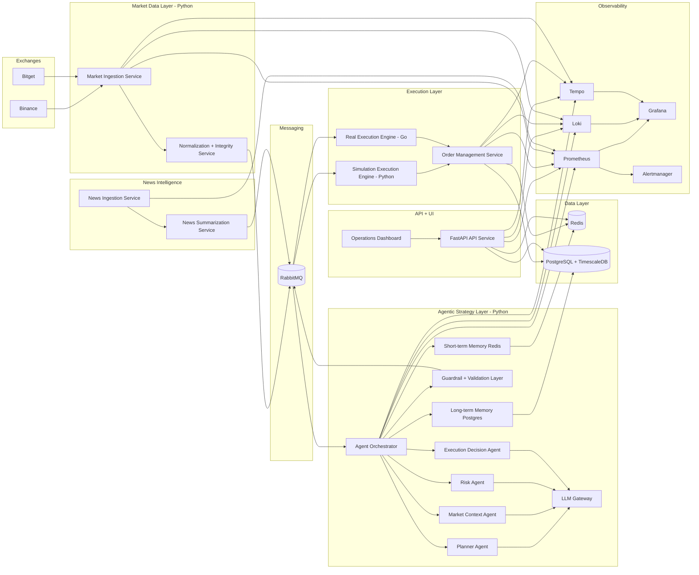
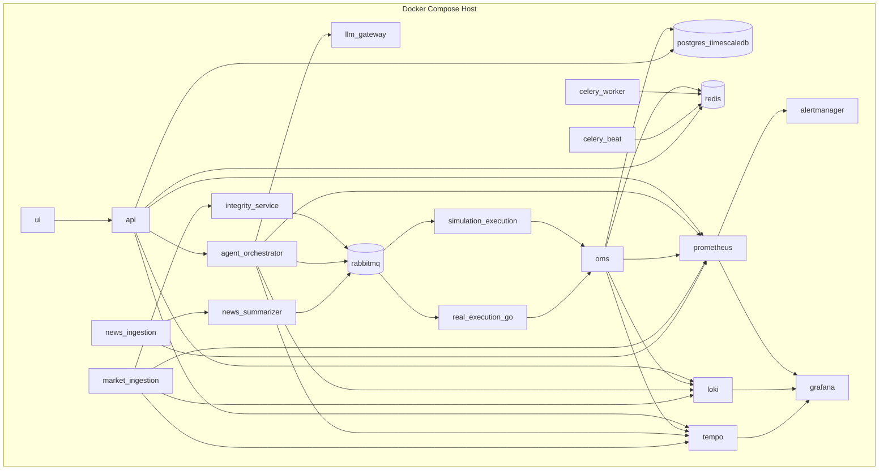
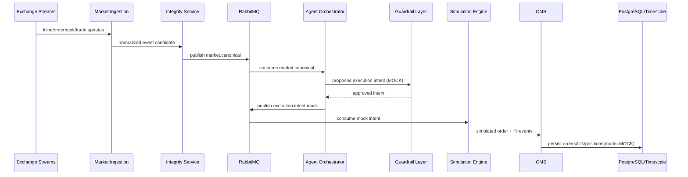
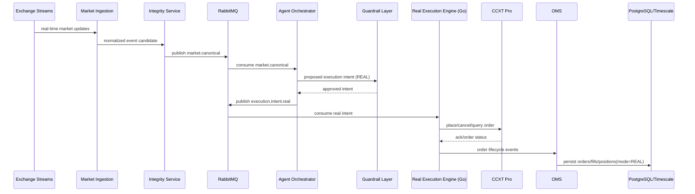
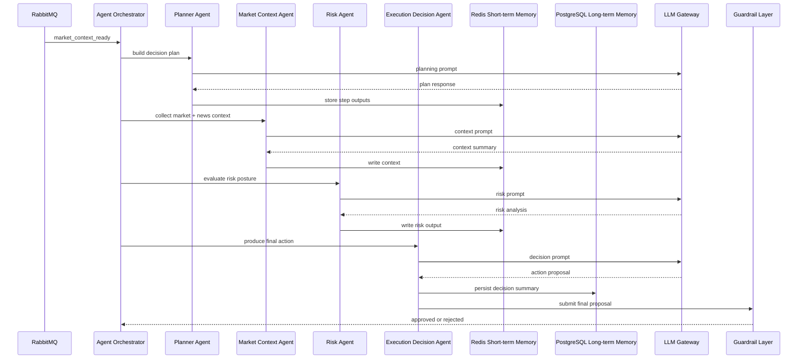

# Architecture Requirements Document (ARD)

## LLM-Based Multi-Exchange Crypto Trading System

- Version: 1.1 (Revised)
- Date: 2026-02-14
- Status: Implementation-ready architecture baseline
- Related PRD: `./docs/PRD_Consolidated.md`

## 1. Scope and Architectural Objectives

This document defines the production architecture for an agent-based crypto trading platform that supports mock and real trading modes, strict risk controls, full LLM observability, and a crypto news intelligence module.

Architecture objectives:

- Deterministic risk-authoritative trading decisions
- Clear separation between market data ingestion and execution paths
- Hard separation between simulated and real execution engines
- End-to-end traceability of agent prompts, responses, and trade decisions
- Production-grade observability, integrity checks, and operational controls

## 2. Technology Stack Selection by Component

This stack is authoritative and final. Exactly one technology is selected per category.

| Category                             | Selected Technology                | Production Rationale                                                                                            |
| ------------------------------------ | ---------------------------------- | --------------------------------------------------------------------------------------------------------------- |
| Primary language                     | Python 3.13+                       | Fast implementation velocity for data, orchestration, and LLM-heavy services with mature async ecosystem.       |
| Performance-critical services        | Go                                 | Low-latency, predictable execution for order routing and exchange order handling.                               |
| Exchange integration                 | CCXT Pro                           | Unified WebSocket and REST API surface for multi-exchange integration and lifecycle management.                 |
| Message broker / stream bus          | RabbitMQ                           | Reliable at-least-once delivery, routing controls, acknowledgements, retries, and dead-letter workflows.        |
| Cache                                | Redis                              | Low-latency shared state for short-term memory, hot market snapshots, rate limits, and coordination primitives. |
| Relational + time-series database    | PostgreSQL + TimescaleDB extension | Single durable system of record for transactional trading data and high-volume time-series market data.         |
| Non-latency-critical task processing | Celery with Redis broker/backend   | Operationally simple background job execution for periodic, non-critical workflows.                             |
| Secrets management                   | `.env` environment variables       | Simple, explicit runtime configuration model for controlled deployment environments.                            |
| Containerization and deployment      | Docker Compose                     | Deterministic service topology, local-to-prod parity, and operational simplicity for current deployment stage.  |
| API framework                        | FastAPI                            | Typed contracts, async support, and robust API development for operational endpoints.                           |
| LLM integration layer                | LiteLLM                            | Unified provider access, quota enforcement, and cost accounting across agents.                                  |
| Metrics                              | Prometheus                         | Standard metrics scraping and alert-compatible telemetry foundation.                                            |
| Dashboards                           | Grafana                            | Unified operational dashboards for system, trading, and LLM governance metrics.                                 |
| Logging                              | Loki                               | Centralized log aggregation for structured service logs with query support.                                     |
| Trace instrumentation                | OpenTelemetry                      | Standardized cross-service trace context propagation for Python and Go services.                                |
| Trace backend                        | Tempo                              | Durable storage and query for distributed traces.                                                               |
| Alerting                             | Alertmanager                       | Deterministic rule-based alert fan-out for incidents and policy breaches.                                       |

## 3. High-Level Architecture Overview

### 3.1 Component Architecture

### 3.2 Service Boundary Summary

- Market Ingestion Service (Python): exchange streams, reconnect, snapshots, normalization input.
- Normalization + Integrity Service (Python): schema validation, gap detection, order book resync triggers, kline validation.
- Agent Orchestrator (Python): dynamic multi-agent execution, memory coordination, decision trace assembly.
- LLM Gateway (Python): provider calls, quotas, token accounting, prompt/response persistence hooks.
- Guardrail + Validation Layer (Python): policy checks, schema checks, risk gate checks before order intent publication.
- Simulation Execution Engine (Python): mock fills, slippage model, simulated PnL, no exchange order calls.
- Real Execution Engine (Go): idempotent order submission/cancel, exchange endpoint integration through CCXT Pro wrapper API contracts.
- OMS (Python): order lifecycle state machine, fill reconciliation, position updates.
- News Ingestion + Summarization Services (Python): external news collection, normalization, summarization, agent context enrichment.
- API Service (Python/FastAPI): UI/API surface, RBAC, control plane, dashboards.

## 4. Deployment Topology (Docker Compose)

### 4.1 Deployment Diagram

### 4.2 Network and Isolation Requirements

- Public network: `ui`, `api`
- Internal network: all other services
- `rabbitmq`, `redis`, and `postgres_timescaledb` are internal-only
- Exchange API egress allowed only for `market_ingestion` and `real_execution_go`

### 4.3 Configuration and Secrets

- All secrets and runtime configuration are supplied by `.env` files.
- `.env` files are mounted/injected at container startup.
- No secrets are committed to source control.

## 5. Trading Modes and Execution Architecture

### 5.1 Trading Mode Model

`strategy_mode` is mandatory and enum-constrained:

- `MOCK`
- `REAL`

### 5.2 Mode Separation Requirements

- Market ingestion path is shared between both modes.
- Decision generation path is shared between both modes.
- Execution intent routing is mode-specific:
  - `MOCK` -> Simulation Execution Engine
  - `REAL` -> Real Execution Engine
- OMS, portfolio, and observability are shared with mode-tagged records.

### 5.3 Execution Adapter Boundaries

- Simulation Execution Engine must never instantiate exchange order clients.
- Real Execution Engine must use CCXT Pro client abstraction for order endpoints.
- Mode leakage is blocked by explicit routing policy and startup assertions.

## 6. Agent-Based Strategy Architecture

### 6.1 Required Agents

- Planner Agent: determines dynamic execution plan and agent invocation order.
- Risk Agent: evaluates risk posture and policy signals before execution intent.
- Execution Decision Agent: proposes final action (`BUY`, `SELL`, `HOLD`, `CLOSE`) and execution parameters.
- Market Context Agent (optional per strategy): enriches decision context from market microstructure and news summaries.

### 6.2 Orchestration Pattern

- Orchestrator receives `market_context_ready` event from RabbitMQ.
- Planner Agent generates plan graph for the current decision cycle.
- Orchestrator executes agent tasks according to plan graph.
- Each agent result is written to shared memory and event trace.
- Guardrail layer validates aggregate decision before intent publication.
- Approved intent is emitted to `execution.intent` queue.

### 6.3 Agent Communication Pattern

- Communication is message-driven through orchestrator-managed envelopes.
- Envelope fields:
  - `trace_id`
  - `decision_id`
  - `agent_name`
  - `input_ref`
  - `output_ref`
  - `timestamp`
- Agent-to-agent direct calls are not allowed.

### 6.4 Shared Memory Implementation

- Short-term memory: Redis
  - Per-decision context window
  - Intra-cycle intermediate results
  - TTL-scoped memory entries
- Long-term memory: PostgreSQL
  - Decision summaries
  - Performance feedback
  - Agent reflection records
  - News impact correlations

### 6.5 Guardrails and Validation Layer

Mandatory validations before execution intent:

- Output schema validation
- Risk policy validation
- Allowed symbol/exchange validation
- Leverage and exposure validation
- Confidence threshold validation
- Mode-specific execution constraints

## 7. LLM Governance and Full Observability

### 7.1 Token Governance Requirements

System must enforce:

- Per-strategy daily token limit
- Per-agent daily token limit
- Per-strategy monthly cost limit
- Hard stop on quota breach
- Alert generation on 80%, 95%, 100% quota utilization

### 7.2 Prompt and Response Persistence

For each model call, persist:

- Full prompt payload
- Full model response payload
- Provider and model IDs
- Prompt tokens, completion tokens, total tokens
- Request/response latency
- Cost estimate
- Agent and strategy identifiers
- Trace and decision identifiers

### 7.3 Replay Capability

Replay service requirements:

- Rebuild decision context from persisted inputs
- Reconstruct agent execution order
- Re-render prompts/responses per step
- Compare replay output vs original stored decision

### 7.4 Token Usage Dashboard Requirements

Dashboard must support:

- Per-strategy usage trend
- Per-agent usage trend
- Daily and monthly aggregation
- Cost trend and forecast
- Quota state and breach events

## 8. Crypto News Module Architecture

### 8.1 News Ingestion

- Collect from curated crypto news feeds and social sources including X/Twitter where access is available.
- Ingestion interval is configurable.
- Deduplicate by source ID + content hash.

### 8.2 News Persistence

Persist:

- Raw headline/body/source URL
- Source metadata and publish timestamp
- Language and asset tags
- Normalized sentiment and relevance scores

### 8.3 News Summarization and Injection

- News Summarization Service builds rolling summaries per symbol and global market context.
- Summaries are published to RabbitMQ and attached to Market Context Agent inputs.
- Summary staleness policy controls whether stale summaries are excluded.

### 8.4 Resilience

- News module failures do not block trading pipeline.
- Fallback behavior: continue decision cycle with `news_unavailable` flag.

## 9. Data Flow Definitions

### 9.1 Shared Market Data Flow

1. Market Ingestion receives exchange stream events.
2. Integrity Service validates sequence and structure.
3. Canonical events are published to RabbitMQ.
4. Market snapshots are persisted to TimescaleDB.
5. Strategy Orchestrator consumes canonical events.

### 9.2 Mock Trading Data Flow

1. Orchestrator emits validated execution intent tagged `MOCK`.
2. Simulation Engine consumes intent and computes simulated fills.
3. OMS records simulated order lifecycle and updates simulated positions.
4. Portfolio snapshots and PnL are persisted with `mode=MOCK`.

### 9.3 Real Trading Data Flow

1. Orchestrator emits validated execution intent tagged `REAL`.
2. Real Execution Engine submits order to exchange via CCXT Pro.
3. Exchange acknowledgements and fills are reconciled by OMS.
4. Portfolio snapshots and PnL are persisted with `mode=REAL`.

## 10. Sequence Diagrams

### 10.1 Mock Trade Flow

### 10.2 Real Trade Flow

### 10.3 Agent Decision Flow

## 11. Data Schema Requirements

### 11.1 Core Trading Tables

- `exchanges`
- `symbols`
- `klines` (Timescale hypertable)
- `orderbook_snapshots` (Timescale hypertable)
- `orders`
- `fills`
- `positions`
- `portfolio_snapshots` (Timescale hypertable)

### 11.2 Agent and Decision Trace Tables

- `decision_traces`
  - `decision_id`, `trace_id`, `strategy_id`, `mode`, `status`, `started_at`, `completed_at`
- `agent_runs`
  - `agent_run_id`, `decision_id`, `agent_name`, `input_ref`, `output_ref`, `latency_ms`, `status`
- `agent_messages`
  - `message_id`, `agent_run_id`, `role`, `payload_json`, `created_at`

### 11.3 LLM Governance Tables

- `llm_calls`
  - `llm_call_id`, `trace_id`, `decision_id`, `strategy_id`, `agent_name`, `provider`, `model`, `prompt_payload`, `response_payload`, `prompt_tokens`, `completion_tokens`, `total_tokens`, `latency_ms`, `estimated_cost`, `created_at`
- `llm_usage_daily`
  - `strategy_id`, `agent_name`, `date`, `total_tokens`, `estimated_cost`
- `llm_usage_monthly`
  - `strategy_id`, `agent_name`, `month`, `total_tokens`, `estimated_cost`
- `llm_quota_limits`
  - `strategy_id`, `agent_name`, `daily_token_limit`, `monthly_cost_limit`, `is_hard_limit`

### 11.4 News Module Tables

- `news_items`
  - `news_id`, `source`, `source_item_id`, `url`, `title`, `body`, `published_at`, `ingested_at`, `hash`, `language`, `raw_payload`
- `news_tags`
  - `news_id`, `symbol`, `topic`, `relevance_score`, `sentiment_score`
- `news_summaries`
  - `summary_id`, `symbol_scope`, `window_start`, `window_end`, `summary_text`, `token_count`, `generated_at`
- `decision_news_links`
  - `decision_id`, `summary_id`, `news_id`

### 11.5 Mode and Replay Support Fields

- `orders.mode` and `fills.mode` must be enum(`MOCK`,`REAL`).
- Replay support uses immutable payload snapshots in `llm_calls` and `agent_messages`.

## 12. Risk Management Architecture Requirements

Mandatory controls:

- Position size limits
- Per-symbol exposure limits
- Max drawdown protection
- Daily loss limit
- Circuit breakers
- Leverage validation
- Kill switch

Risk enforcement points:

- Pre-intent validation in Guardrail Layer
- Pre-submit validation in execution engines
- Post-fill risk recalculation in OMS

## 13. Latency, Reliability, and Delivery Guarantees

### 13.1 Latency Targets

- Internal execution dispatch (Go engine): <= 20ms p95
- Signal-to-execution-intent publish: <= 80ms p95
- Signal-to-order-request dispatch: <= 150ms p95 (excluding exchange response)

### 13.2 Reliability Requirements

- RabbitMQ delivery semantics: at-least-once with manual acknowledgements
- Dead-letter queues for poison messages
- Retry policy with bounded exponential backoff
- Idempotency keys for order actions and fill ingestion

### 13.3 Failover Handling

- Exchange API transient failure: retry with backoff and state reconciliation
- Broker reconnect: consumer auto-recovery and queue rebind
- Service restart: resume from durable queues and persisted offsets/checkpoints

## 14. Data Integrity Controls

- WebSocket reconnect logic with heartbeat and stale stream cutover
- Order book resync logic using snapshot + sequence window replay
- Gap detection for sequence discontinuity and missing events
- K-line reconstruction validation for interval completeness and monotonic timestamps
- Integrity exceptions generate alerts and trigger controlled resync workflow

## 15. Security Requirements

### 15.1 API Key Encryption at Rest

- Exchange keys are encrypted before persistence using AES-256-GCM.
- Encryption key is loaded from `.env` at runtime.

### 15.2 Network Isolation

- Public access limited to UI/API.
- Internal services are isolated on private Docker networks.
- Data stores and broker are not externally exposed.

### 15.3 RBAC

- RBAC roles:
  - `viewer`
  - `operator`
  - `admin`
- Only `operator` and `admin` can trigger mode changes and trading actions.

### 15.4 Transport and Access Controls

- TLS termination at ingress proxy for all external traffic.
- JWT authentication for API/UI.
- Strict CORS policy.

## 16. Observability Architecture Requirements

### 16.1 Centralized Structured Logging

- JSON logs with `trace_id`, `decision_id`, `order_id`, `strategy_id`, `mode`, `service`.
- Log transport to Loki.

### 16.2 Metrics Collection

- Prometheus scrape targets for all services.
- Required metric groups:
  - Market ingestion rates and lag
  - Agent run latencies and failure rates
  - LLM tokens/costs/quotas
  - Order lifecycle and rejection rates
  - Risk breach counters
  - News ingestion and summarization metrics

### 16.3 Distributed Tracing

- OpenTelemetry instrumentation in Python and Go services.
- End-to-end trace continuity from market event to final order update.

### 16.4 Health Checks and Alerting

- Liveness and readiness endpoints for each service.
- Alertmanager rules for:
  - Exchange disconnects
  - LLM quota breaches
  - Drawdown/daily loss breaches
  - Elevated order failures
  - Data integrity resync events

## 17. Celery Scope and Background Workloads

Celery is restricted to non-latency-critical workloads:

- News backfill jobs
- Daily/monthly usage rollups
- Replay report generation
- Data retention and archival maintenance

No real-time execution path may depend on Celery.

## 18. Implementation Constraints and Governance

- Any change to mandatory stack requires explicit architecture approval.
- `MOCK` and `REAL` mode routing rules are immutable without change control.
- Guardrail checks are mandatory and cannot be bypassed by strategy logic.
- Prompt/response persistence is mandatory for all agent LLM calls.

## 19. Definition of Done for Architecture

Architecture implementation is complete when:

- All services run in Docker Compose with documented `.env` contract.
- Mock and real flows pass integration tests and mode-isolation tests.
- Full decision replay reproduces stored decision traces.
- Token governance dashboard and quota enforcement are operational.
- Integrity, risk, and observability controls are validated in staged failure drills.
